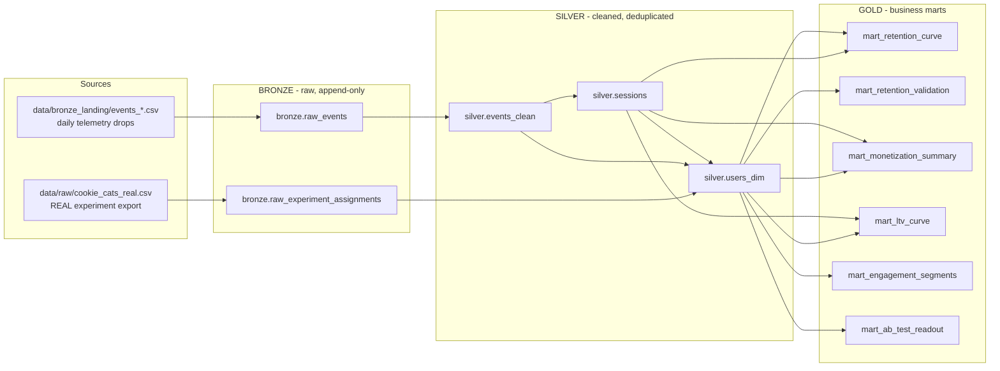

# Multi-Layer Data Warehouse for Player Analytics (Bronze / Silver / Gold)

A medallion-architecture data warehouse for mobile game telemetry, built on
top of a **real, publicly-published gaming dataset**: the Cookie Cats A/B
test (Tactile Entertainment), 90,189 actual players. Raw event ingestion
(Bronze) → cleaned, deduplicated, sessionized events (Silver) → retention
and monetization business marts (Gold), implemented with DuckDB SQL using
CTEs and window functions throughout.

## 1. Where the data comes from

| Field | Status | Source |
|---|---|---|
| `userid`, `version` (gate_30 / gate_40), `sum_gamerounds`, `retention_1`, `retention_7` | **REAL** | The public [Cookie Cats mobile-game A/B test dataset](https://www.kaggle.com/datasets/mursideyarkin/mobile-games-ab-testing-cookie-cats) — 90,189 real players of a real, shipped game, released for analytics education. `data/raw/cookie_cats_real.csv` is the byte-for-byte original file. |
| Event timestamps, session boundaries, individual level-progress pings, device/platform/country, in-app purchases | **Derived (simulated, calibrated to the real data)** | Game studios do not publish raw player-level clickstreams (privacy), so no public raw event export of this experiment exists. `scripts/generate_bronze_events.py` expands each real player's record into a plausible raw event stream that is *forced to reproduce that player's real `sum_gamerounds` and real `retention_1`/`retention_7` outcome exactly*. |

This is a common, transparent pattern for building realistic data-engineering
practice projects: the **business ground truth is 100% real**, and the
**event-level granularity needed to demonstrate a warehouse pipeline** is
reconstructed on top of it. The `Run & verify` section below shows the
Gold-layer retention numbers, recomputed independently from raw synthetic
events, landing within a hundredth of a percentage point of the real
published rates — i.e. the pipeline is provably faithful to the ground truth.

The generator also injects the kind of mess a real Bronze layer has to deal
with: ~1.5% duplicate events (at-least-once delivery retries), events that
arrive late (0–26h delivery lag, out of order in the landing files), and a
sprinkling of missing metadata fields.

## 2. Architecture



## 3. Layer-by-layer

### Bronze (`sql/bronze/01_bronze.sql`)
Loads files exactly as they arrive, as text, with ingestion metadata
(`_ingested_at`, `_source_file`) — no cleaning, no dedup, duplicates and
nulls preserved on purpose.

- `bronze.raw_events` — 1.46M rows from 45 daily CSV drops
- `bronze.raw_experiment_assignments` — the real 90,189-row experiment export

### Silver (`sql/silver/`)
- **`silver.events_clean`** — dedupes `bronze.raw_events` with a
  `ROW_NUMBER() OVER (PARTITION BY event_id ORDER BY _ingested_at)` CTE, and
  casts every column to its proper type.
- **`silver.sessions`** — classic gap-based sessionization: `LAG()` to get
  each user's previous event time, a new-session flag when the gap exceeds
  30 minutes, and a running `SUM()` window to assign session numbers — then
  aggregates raw events up into 354,551 real sessions (start/end time,
  duration, rounds played, revenue, purchase count).
- **`silver.users_dim`** — one row per real player: the real A/B arm, real
  `sum_gamerounds`/retention flags, an install date derived from the
  cleaned events, and event-derived rounds/retention recomputed
  independently for validation.

### Gold (`sql/gold/`)
- **`mart_retention_curve`** — day-by-day retention (D0–D13) per A/B arm
  with a 3-day trailing moving average window function.
- **`mart_retention_validation`** — real vs. event-derived retention, side
  by side (the data-quality proof point).
- **`mart_monetization_summary`** — ARPU, ARPPU, conversion rate and total
  revenue by A/B arm, platform, and country.
- **`mart_ltv_curve`** — cumulative LTV-per-user curve via a running-total
  window function (`SUM() OVER (... ROWS UNBOUNDED PRECEDING)`).
- **`mart_engagement_segments`** — `NTILE(4)` + `RANK()` quartile
  segmentation (non_activated / casual / regular / core / power_user).
- **`mart_ab_test_readout`** — reproduces the original real Cookie Cats
  experiment analysis (gate_30 vs. gate_40) end-to-end through the
  warehouse.

## 4. Results (this run)

| Metric | gate_30 | gate_40 |
|---|---|---|
| Users | 44,700 | 45,489 |
| D1 retention (real) | 44.82% | 44.23% |
| D7 retention (real) | 19.02% | 18.20% |
| Conversion rate | 32.95% | 32.37% |
| ARPU (14-day) | $6.16 | $6.11 |
| ARPPU | $18.69 | $18.89 |

This reproduces the real, published, slightly counter-intuitive finding
from the actual Cookie Cats experiment: moving the progress gate from
level 30 to level 40 (`gate_40`) very slightly **hurt** both day-1 and
day-7 retention rather than helping it.

Engagement segments (from `mart_engagement_segment_summary`):

| Segment | Users | Avg. rounds |
|---|---|---|
| non_activated | 3,994 | 0.0 |
| casual | 18,554 | 2.4 |
| regular | 22,547 | 9.8 |
| core | 22,547 | 30.2 |
| power_user | 22,547 | 165.5 |

## 5. Project layout

```
player_analytics_dwh/
├── data/
│   ├── raw/cookie_cats_real.csv        # REAL dataset, untouched
│   └── bronze_landing/events_*.csv     # derived raw event drops (45 files)
├── sql/
│   ├── bronze/01_bronze.sql
│   ├── silver/01_silver_events.sql
│   ├── silver/02_silver_users.sql
│   └── gold/01_gold_retention.sql, 02_gold_monetization.sql, 03_gold_engagement_segments.sql
├── scripts/
│   ├── generate_bronze_events.py       # builds the raw event stream from the real csv
│   └── run_pipeline.py                 # runs bronze -> silver -> gold + validation
├── game_analytics.duckdb               # the built warehouse (DuckDB file)
└── README.md
```

## 6. How to run it

Requires Python 3 with `duckdb`, `pandas`, `numpy` (`pip install duckdb pandas numpy`).

```bash
# 1. (optional) regenerate the raw event stream from the real csv
python3 scripts/generate_bronze_events.py

# 2. run the full bronze -> silver -> gold pipeline + validation checks
python3 scripts/run_pipeline.py

# 3. explore the warehouse
python3 -c "import duckdb; con = duckdb.connect('game_analytics.duckdb'); print(con.sql('SELECT * FROM gold.mart_ab_test_readout'))"
# or, if you have the duckdb CLI installed:
duckdb game_analytics.duckdb -c "SELECT * FROM gold.mart_retention_curve LIMIT 20;"
```

`run_pipeline.py` ends with an automated validation section that checks:
row-count integrity end to end, that deduplication actually removed the
injected duplicate events, that no duplicate `event_id`s remain, that every
session maps to a known user, and — the key trust check — that the
Gold-layer retention rates **recomputed purely from raw events** match the
real published `retention_1`/`retention_7` rates to within a fraction of a
percentage point.

## 7. Ideas for extending this project

- Add a `bronze` incremental-load mode (only ingest new landing files) instead of full rebuild.
- Add a `gold.mart_cohort_retention_heatmap` (install-week × day-since-install grid).
- Swap DuckDB for Postgres/Snowflake and orchestrate with dbt or Airflow.
- Add slowly-changing-dimension (SCD Type 2) tracking on `silver.users_dim` for platform/app-version changes over time.
- Layer in a churn-prediction model trained on `gold.mart_engagement_segments`.
